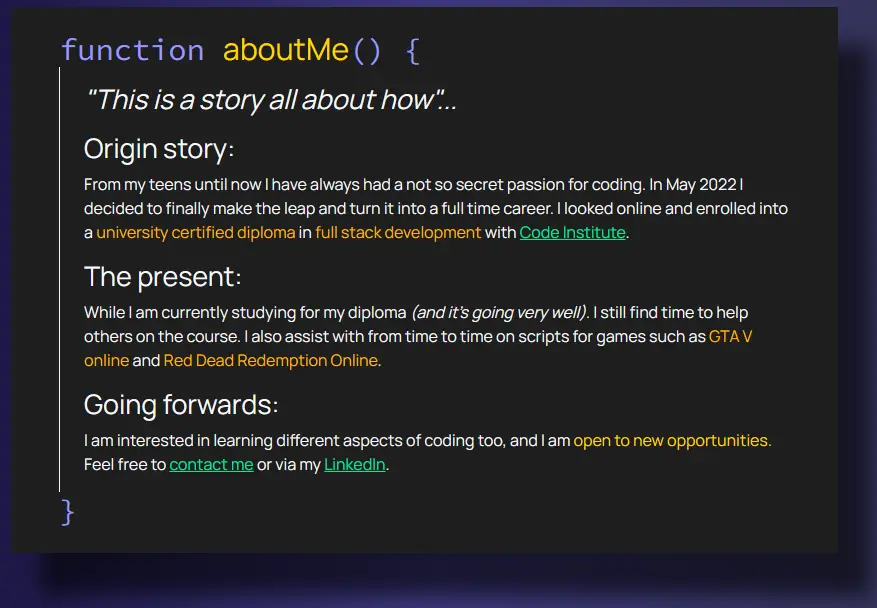

# My Portfolio Website

Thank you for checking out my project in creating my portfolio website.

## Contents

- [Live Site](#live-site)
- [Repository](#repository)
- [Overall Objective](#overall-objective)
- [Design Objectives](#design-objectives)
- [Design Outcome](#design-outcome)
- [Technologies](#technologies)
- [Typography](#typography)
- [Features](#features)
  - [Reveal Sections](#reveal-sections)
  - [Image Preview](#image-preview)
- [Bugs](#bugs)
  - [Resolved](#resolved)
  - [Unresolved](#unresolved)
- [Credit](#credits)

---

## Live Site

Live site: [My portfolio website](https://bobwritescode.github.io/portfoli-website/).

---

## Repository

Repository: [GitHub](https://github.com/BobWritesCode/portfoli-website).

---

## Overall Objective

To create a portfolio website I could use to showcase my projects and provide relevant information about me as a developer in one place.

---

## Design Objectives

The site must:

- Be easy to navigate for all users.
- Have clear defined sections.
- Be obvious what / who the site is about immediately.

---

## Design Outcome

After a few different ideas. I landed on a code editor theme. Inspired by Visual Studios.


I created modules so each section would be in its own code block theme.



---

## Technologies

This site is built using:

- HTML 5
- CSS 3
- TypeScript
- JavaScript
- JQuery v3.6.1
- BootStrap v5.0.2

---

## Typography

I use 2 different fonts which are:

- For the main font I user [Manrope from Google Fonts](https://fonts.google.com/specimen/Manrope).
- For the coding style front I use [Source Code Pro from Google Fonts](https://fonts.google.com/specimen/Source+Code+Pro).

---

## Features

### Reveal Sections

As you scroll down the site there is a a nice simple animation of the modules coming in from the right side. I used [original code](https://alvarotrigo.com/blog/css-animations-scroll/#:~:text=What%20are%20CSS%20Scroll%20Animations,text%2C%20images%2C%20and%20videos) which I modified slightly to provide the functionality I was after.

I added in that when the user is at the top of the page then all modules except the top module would be hidden.

I also changed the animation to come in from the right instead from the bottom.

Having the code though come in from the right, caused the page to widen further than expected. So I had to add an overflow restriction and restrict zooming out on mobile devices.

```html
<!--minimum-scale=1.0 stop zooming out -->
<meta name="viewport" content="width=device-width, initial-scale=1.0, minimum-scale=1.0">
```

```javascript
// Every time the page scroll run these functions
window.addEventListener("scroll", function () {
  reveal();
});
```

```javascript
/**
 * Activates the reveal effect when scrolling through the page.
 */
function reveal() {
    // Section needs to pass the 20% mark from the bottom of the window to show.
    const elementVisible = window.innerHeight * 0.8;
    // Get top page element.
    const siteTop = document.getElementById("top").getBoundingClientRect().top;
    // Get bottom page element.
    const siteBottom = document.getElementById("footer").getBoundingClientRect().bottom;
    // Check if user at bottom of page.
    if (siteBottom < window.innerHeight + 1) {
        // If user at bottom of page, show all sections
        $.each($(".reveal"), (_, val) => {
            val.classList.add("active");
            if (val.getAttribute('id') === 'tech-section') {
                toggleBars("open");
            }
        });
        // Check to see if user at top of page.
    }
    else if (siteTop > 10) {
        // If at top of page hide all but top section
        $.each($(".reveal"), (_, val) => {
            val.classList.remove("active");
            if (val.getAttribute('id') === 'tech-section') {
                toggleBars("close");
            }
            ;
        });
        // If user not at bottom of page.
    }
    else {
        // As scroll check each element.
        $.each($(".reveal"), (_, val) => {
            if (val.getBoundingClientRect().top < elementVisible && siteTop !== 0) {
                val.classList.add("active");
                if (val.getAttribute('id') === 'tech-section') {
                    toggleBars("open");
                }
            }
            else {
                val.classList.remove("active");
                if (val.getAttribute('id') === 'tech-section') {
                    // Tech sections is not currently being shown
                    toggleBars("close");
                }
            }
        });
    }
    if (siteTop === 0) {
        $("#scroll_flash")
            .find("h3")
            .delay(2000)
            .fadeIn("slow", () => {
            $("#scroll_flash").removeClass("d-none");
        });
    }
    else {
        $("#scroll_flash")
            .find("h3")
            .fadeOut("fast", () => {
            $("#scroll_flash").addClass("d-none");
        });
    }
}
```

```css
/* Reveal module from right to left */
.reveal {
  position: relative;
  transform: translateX(150px);
  opacity: 0;
  transition: 2s all ease;
}

.reveal.active {
  transform: translateY(0);
  opacity: 1;
}
```

### Image Preview

To view the certificates I added a popup style image preview. The main challenge was stopping the screen scrolling when the image appeared.

To avoid that happening I created a container that is always there but you can't see.

```html
<!-- Image Preview -->
<div id="image-preview-container"
  class="col-12 d-none bg-dark h-100 p-0 align-items-center justify-content-center">
  <div class="d-flex col-10 h-100 justify-content-center align-items-center flex-column">
    
    <button id='btnClosePreview' class="btn-portfolio mt-3 w-50">CLOSE</button>
  </div>
</div>
```

```css
#image-preview-container {
  position: fixed !important;
  top: 0;
  z-index:5000 !important;
}

#image-preview-container img {
  border: var(--code-orange) solid 8px;
  max-width: 75vw;
  max-height: 75vh;
}

#image-preview-container button {
  border-color : var(--code-orange) !important;
  color: var(--code-orange) !important;
  background-color: rgba(0, 0, 0, 0);
}

#image-preview-container button:hover {
  background-color: var(--code-orange) !important;
  color: #000000 !important;
}
```

---

## Bugs

### Resolved

#### Bug 1

**MOBILE: White space on right side of screen.**

[971e9ad](https://github.com/BobWritesCode/portfoli-website/commit/971e9ad173ab8d6dcd9ff69726bd38992226dcd1)

**Problem**: While site viewed perfectly on PC, on mobile phones there seemed to be a white space on the right side due to the elements coming in from that side as you scrolled down.

**Solution**: The solution was either putting the site in a `div` wrapper and applying the below CSS or/and restricting the user from zooming.

```html
<meta name="viewport" content="width=device-width, initial-scale=1.0, minimum-scale=1.0">
```

```css
#site-wrapper {
  position: relative;
  overflow-x: hidden;
  width: 100%;
  max-width: 100%;
}
```

#### Bug 2

**MOBILE: White space appearing at bottom of page as you scroll down**

**Problem**: White space seems to be caused by mobile interface continually trying to put footer too early.

**Solution**: *Unknown* - The problem seemed to disappear at some point during one of my commits.

### Unresolved

There are currently no unresolved bugs I am aware of.

---

## Credits

- Thank you **Zack Owen** for helping to solve [Bug 1](#bug-1).
- [Original code](https://alvarotrigo.com/blog/css-animations-scroll/#:~:text=What%20are%20CSS%20Scroll%20Animations,text%2C%20images%2C%20and%20videos) for reveal animation before modifications I made.
